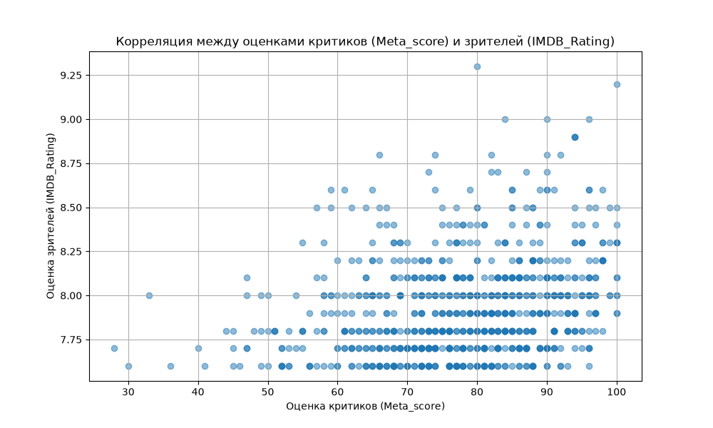

# Проект: Анализ данных из топ-1000 фильмов по версии IMDb

Этот проект представляет собой комплексный анализ данных о 1000 лучших фильмах по версии IMDb. Основная цель — продемонстрировать полный цикл работы с данными: от загрузки и очистки до глубокого анализа и визуализации результатов.

## Инструменты и технологии
*   **Язык:** Python
*   **Библиотеки:**
    *   **Pandas:** для всех операций с данными (чтение, очистка, фильтрация, агрегация).
    *   **Matplotlib:** для построения диаграммы рассеяния и визуализации результатов.
    *   **OS:** для надежного взаимодействия с файловой системой (проверка существования файла, построение абсолютных путей).

## Методология: Разработка с ИИ-ассистентом
Этот проект был реализован в тесном сотрудничестве с продвинутым ИИ-ассистентом (Gemini). Такой подход был выбран сознательно, чтобы продемонстрировать современный рабочий процесс, в котором специалист выступает в роли ведущего аналитика, а ИИ — в роли мощного инструмента для генерации кода, объяснения сложных концепций и совместного дебаггинга.

*   **Роль аналитика (человека):** Постановка задач, формулирование гипотез, проверка и отладка кода, интерпретация результатов и принятие финальных решений.
*   **Роль ИИ-ассистента:** Генерация кода по запросу, пошаговое объяснение синтаксиса и концепций, предложение альтернативных решений и помощь в поиске и устранении ошибок.

## Источник данных
Данные взяты из публичного набора данных с платформы Kaggle: [IMDb Movies Dataset](https://www.kaggle.com/datasets/harshitshankhdhar/imdb-dataset-of-top-1000-movies-and-tv-shows). Датасет содержит информацию о 1000 фильмах, включая рейтинги, год выпуска, режиссеров и актерский состав.

---

## Этап 1: Аудит и проверка качества данных

Любой серьезный анализ начинается с проверки "здоровья" данных. На этом этапе были поставлены две задачи: найти аномалии (дубликаты) и оценить полноту данных (пропущенные значения).

### 1.1. Анализ дубликатов

Первичный анализ выявил, что при 1000 строк в данных было всего 999 уникальных названий. Расследование показало, что это не ошибка, а два разных фильма с одинаковым названием:

| Series_Title  | Released_Year | IMDB_Rating | Director        |
|:--------------|:--------------|:------------|:----------------|
| Drishyam      | 2013          | 8.3         | Jeethu Joseph   |
| Drishyam      | 2015          | 8.2         | Nishikant Kamat |

**Вывод:** Данные корректны и не требуют удаления. Аномалия объясняется наличием оригинала и ремейка в списке лучших фильмов.

### 1.2. Анализ пропущенных значений

Проверка показала наличие пропусков в трех ключевых колонках, что важно учитывать для дальнейшего анализа:

*   `Certificate` (возрастной рейтинг): 101 пропуск
*   `Meta_score` (оценка критиков): 157 пропусков
*   `Gross` (кассовые сборы): 169 пропусков

**Вывод:** Для разных этапов анализа будет применяться разная стратегия. Для целевого анализа (поиск актера) пропуски можно игнорировать, для корреляционного анализа строки с отсутствующими оценками будут исключены.

---

## Этап 2: Целевой анализ: Карьера Уиллема Дефо

На этом этапе был проведен анализ для ответа на конкретный вопрос: какие фильмы с участием актера Уиллема Дефо входят в топ-1000?

**Результаты:**
В топ-1000 было найдено 5 фильмов, где Уиллем Дефо входит в топ-4 главных актеров.

| Series_Title          | Released_Year | IMDB_Rating | Meta_score | Director        |
|:----------------------|:--------------|:------------|:-----------|:----------------|
| Platoon               | 1986          | 8.1         | 92.0       | Oliver Stone    |
| Togo                  | 2019          | 8.0         | 69.0       | Ericson Core    |
| The Boondock Saints   | 1999          | 7.8         | 44.0       | Troy Duffy      |
| Mississippi Burning   | 1988          | 7.8         | 65.0       | Alan Parker     |
| The Florida Project   | 2017          | 7.6         | 92.0       | Sean Baker      |

**Вывод:** Анализ показал, что Уиллем Дефо — актер с выдающейся карьерой, стабильно появляющийся в высокооцененных фильмах на протяжении более 30 лет и сотрудничающий с разными культовыми режиссерами.

---

## Этап 3: Проверка гипотезы и визуализация

На финальном этапе была сформулирована и проверена следующая статистическая гипотеза:

> **Существует значимая положительная корреляция между оценками профессиональных критиков (`Meta_score`) и оценками обычных зрителей (`IMDB_Rating`).**

Для проверки гипотезы был рассчитан коэффициент корреляции Пирсона и построена диаграмма рассеяния.

**Результаты и выводы:**

1.  **Коэффициент корреляции составил `+0.27`**. Это указывает на **слабую положительную связь**.
2.  **Общий тренд:** График подтверждает, что в целом, чем выше оценка критиков, тем выше и оценка зрителей. "Облако" точек движется из левого нижнего угла в правый верхний.
3.  **Слабая связь и расхождение мнений:** "Облако" точек очень широкое и размытое. Это говорит о том, что при наличии общего тренда, мнения критиков и зрителей часто расходятся. На графике можно наблюдать множество фильмов со значительным разрывом в оценках. Например, существуют фильмы с относительно невысокой оценкой критиков (в диапазоне 40-60), которые при этом имеют высокие зрительские рейтинги (7.8-8.0), что можно охарактеризовать как.

## Общий вывод по проекту

Данный проект успешно продемонстрировал владение ключевыми инструментами анализа данных (Python, Pandas, Matplotlib) для решения практических задач в рамках современного, эффективного рабочего процесса с использованием ИИ-ассистента. Были выполнены все этапы аналитического процесса: от аудита и очистки данных до проверки гипотез и наглядной визуализации выводов.
